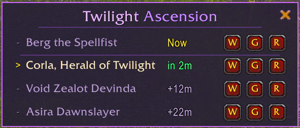

# Twilight Ascension Rares

**Track the Twilight Highlands rare spawn rotation for the Two Minutes to Midnight achievement**

---

## Overview

The **Twilight's Blade** cult is summoning rares across the Twilight Highlands every 5 minutes. Kill all 18 for the [Two Minutes to Midnight](https://www.wowhead.com/achievement=42300/two-minutes-to-midnight) achievement before the Midnight launch.

**Twilight Ascension Rares** removes the guesswork. See exactly which rare is up, what's coming next, and share locations with your group in one click.

> **Note**: Updated for the 5-minute respawn hotfix on Feb 28

## Features

| Feature | Description |
|---------|-------------|
| **Live Schedule** | Shows the current rare and next 3 upcoming spawns with countdown timers |
| **One-Click Waypoints** | TomTom integration (or manual `/way` output if not installed) |
| **Raid/Chat Sharing** | Share any rare with timing info and clickable map pin to General or Raid chat |
| **Themed UI** | Void-purple design that fits the Twilight aesthetic |
| **Auto-Show** | Appears automatically when you enter Twilight Highlands |

## Installation

### CurseForge / WowUp

Search for **Twilight Ascension Rares** in your addon manager.

### Manual

1. Download the latest release from [Releases](https://github.com/cyanheads/TwilightAscensionRares/releases) or [CurseForge](https://www.curseforge.com/wow/addons/twilightascensionrares)
2. Extract `TwilightAscensionRares` folder to your `World of Warcraft/_retail_/Interface/AddOns/` directory
3. Restart WoW or `/reload`

## Commands

| Command | Description |
|---------|-------------|
| `/ta` or `/twilight` | Show help |
| `/ta show` | Show the tracker window |
| `/ta hide` | Hide the tracker window |
| `/ta way` | Set waypoint for current rare |
| `/ta debug` | Show timing debug info |

## Usage Tips

- Use the **W/G/R buttons** on each row to set waypoints or share to General/Raid chat
- The schedule uses **realm time** — works automatically across all regions
- Window position is saved between sessions
- Drag the window to reposition it anywhere on screen

## The Rotation

All 18 rares spawn in a fixed order on a 90-minute cycle:

View full rotation

| # | Rare | Location |
|---|------|----------|
| 1 | Redeye the Skullchewer | 65.2, 52.2 |
| 2 | T'aavihan the Unbound | 57.6, 75.6 |
| 3 | Ray of Putrescence | 71.2, 29.9 |
| 4 | Ix the Bloodfallen | 46.7, 25.2 |
| 5 | Commander Ix'vaarha | 45.2, 48.8 |
| 6 | Sharfadi, Bulwark of the Night | 41.8, 16.5 |
| 7 | Ez'Haadosh the Liminality | 65.2, 52.2 |
| 8 | Berg the Spellfist | 57.6, 75.6 |
| 9 | Corla, Herald of Twilight | 71.2, 29.9 |
| 10 | Void Zealot Devinda | 46.7, 25.2 |
| 11 | Asira Dawnslayer | 45.2, 49.2 |
| 12 | Archbishop Benedictus | 41.8, 16.5 |
| 13 | Nedrand the Eyegorger | 65.2, 52.2 |
| 14 | Executioner Lynthelma | 57.6, 75.6 |
| 15 | Gustavan, Herald of the End | 71.2, 29.9 |
| 16 | Voidclaw Hexathor | 46.7, 25.2 |
| 17 | Mirrorvise | 45.2, 49.2 |
| 18 | Saligrum the Observer | 41.8, 16.5 |

**Bonus:** Voice of the Eclipse can spawn at the top of every hour (destroy nearby Disparate Ephemera to summon).

## Contributing

Contributions are welcome! Feel free to:

- Report bugs via [Issues](https://github.com/cyanheads/TwilightAscensionRares/issues)
- Submit improvements via [Pull Requests](https://github.com/cyanheads/TwilightAscensionRares/pulls)

## Support

If you find this addon helpful, consider [buying me a coffee](https://buymeacoffee.com/cyanheads).

## License

This project is licensed under the Apache License 2.0 - see the [LICENSE](LICENSE) file for details.

---

*Made for the Midnight pre-patch event (January 27 – March 2, 2026)*

